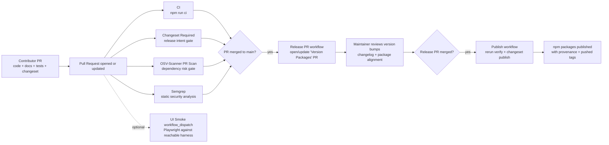

# Releasing to npm

Audience: maintainers publishing new package versions from this repository.

Use this guide after code, tests, and documentation are already aligned and ready to ship.

This repository publishes three public scoped packages:

- `@adriandantas/plugin-service-tokens`
- `@adriandantas/plugin-service-tokens-backend`
- `@adriandantas/plugin-service-tokens-node`

## Prerequisites

- Node.js 22
- An npm account with 2FA enabled
- `npm login` completed locally

Verify the active npm identity:

```bash
npm whoami
```

## Automated GitHub flow

GitHub Actions now owns the normal release lifecycle:

1. Contributor PRs run the `CI` workflow on every pull request and push to `main`.
2. `Changeset Required` enforces the rule that pull requests touching the published package surface include a Changeset.
3. `OSV-Scanner PR Scan` checks pull requests for newly introduced dependency vulnerabilities without requiring GitHub Code Security licensing.
4. `Semgrep` runs open source static analysis on pull requests and pushes to `main`.
5. After a PR merges to `main`, the `Release PR` workflow opens or updates a `Version Packages` pull request with the pending version bumps.
6. When that reviewed release PR is merged into `main`, the `Publish` workflow reruns verification, confirms the merge contains Changesets-managed package version bumps, publishes the changed packages to npm, and pushes the generated release tags back to GitHub.
7. The `UI Smoke` workflow is available as a manual GitHub Actions run for a reachable Backstage harness when you want browser validation without blocking normal CI.

This keeps versioning reviewable while still allowing hands-off publication after approval.

## CI/CD flow at a glance



The important split is:

- PR workflows answer "is this safe to merge?"
- The release PR answers "are these the right versions to ship?"
- The publish workflow answers "can the reviewed release be published reproducibly?"
- Release tags are pushed only after a successful publish run reports published packages
- Ordinary feature merges to `main` must not publish packages; they only refresh the release PR state

The Changeset gate is intentionally scoped to shipped package files, not every repo change. It requires a Changeset for:

- `packages/*/package.json`
- `packages/*/README.md`
- files listed in each package's published `files` array, including shipped runtime source and published `.d.ts`

It does not require a Changeset for:

- `docs/**`
- `.github/**`
- root maintainer files such as `CONTRIBUTING.md`, `mkdocs.yml`, and the root `README.md`
- tests, Storybook stories, fixtures, and other package-local files that are not shipped

## Required repository settings

- Default branch: `main`
- Branch protection on `main` so CI must pass before merge
- Required status checks on pull requests: `CI`, `Changeset Required`, `OSV-Scanner PR Scan`, and `Semgrep`
- `NPM_TOKEN` configured in repository or organization GitHub Actions secrets
- npm package ownership configured for the `@adriandantas` scope
- GitHub Code Security / Advanced Security is not required for the repository's CI security gates

The publish workflow uses npm provenance via `changeset publish --provenance`, so it still requires GitHub Actions OIDC support.

Docs publishing remains intentionally out of scope for this automation pass. If GitHub Pages or another docs deployment is added later, it should use a separate workflow rather than being coupled to npm publication.

## Manual UI smoke expectations

`Manual UI Smoke` is intentionally maintainer-triggered and non-blocking. Use it when you want browser validation against a real Backstage harness without making external harness health a merge requirement.

Before dispatching the workflow, confirm the target harness:

- is reachable from GitHub Actions at the supplied `base_url`
- has the service token plugin installed and the admin route available
- includes catalog data and auth/permission configuration needed for the create, audit, and revoke path
- uses `serviceTokens.cacheTtlSeconds: 0` when you need deterministic revoked-token rejection timing during the smoke flow

## Prepare a release

For normal releases, the maintainer workflow is:

1. Merge feature and fix PRs that include their Changesets.
2. Review the generated `Version Packages` PR for version bumps, internal dependency updates, and changelog accuracy.
3. Merge the release PR.
4. Confirm the `Publish` workflow succeeds and the packages appear on npm.

You can still use the local commands below to inspect or debug the release process before merging.

Install dependencies and run the full verification suite:

```bash
yarn install
npm run ci
```

Create a changeset that describes the release:

```bash
npm run changeset
```

Version the packages and changelog:

```bash
npx changeset version
```

Review the resulting package versions, changelog updates, and published package contents:

```bash
npm run pack:dry-run
```

Before publishing, confirm documentation and compatibility guardrails for this release:

- Auth/authz behavior changes are documented (including enforced vs metadata-only semantics)
- Security-significant or breaking changes include migration notes and operator actions
- Public API or integration pattern changes are called out in release notes/changelogs
- Open security findings from `OSV-Scanner PR Scan` and `Semgrep` are triaged before release
- `Publish` is expected to skip cleanly when `NPM_TOKEN` is not configured, and to push tags only after a successful publish

## Manual publish fallback

GitHub Actions should be the default publish path. Use manual publishing only when you need to recover from a failed automation run or validate the process locally.

Publish all changed packages with public scoped access:

```bash
npx changeset publish
```

For a first manual publish of an individual package, use:

```bash
npm publish --access public
```

Run that command from the package directory you want to publish.

## Post-publish checks

- Confirm each package page exists on npm
- Confirm the package README renders correctly
- Confirm the install snippets in `README.md` still match the published versions
- Confirm the docs still describe the current auth, permission, and scope-enforcement behavior accurately
