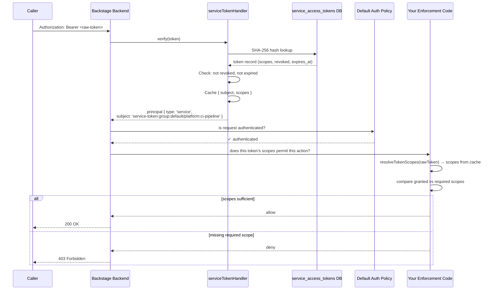

# Scope Enforcement Runbook (Optional)

This runbook helps teams decide **when and how** to enforce service token scopes in their Backstage deployment.

> **Core principle:** Scopes are intent documentation by default. Enforcement is optional and consumer-driven. The plugin's job is token lifecycle — your team's job is authorization policy.

---

## Recommended adoption path

Most teams move through three stages. Start at Stage 1 and advance only when your context demands it.

| Stage | When to use | What you do |
|---|---|---|
| **1 — Document intent** | Default for all teams | Use scopes as metadata; no enforcement code needed |
| **2 — Monitor** | >10 active tokens, or preparing for security review | Log scope mismatches; do not block requests |
| **3 — Enforce** | Compliance requirements, multi-tenant, or post-incident | Block requests with missing required scopes |

> **One-liner:** Start with scopes as intent documentation. Add monitoring when you have >10 tokens. Enforce when compliance or incident history demands it.

---

## Prerequisites

Before adding any enforcement code:

- Backstage new backend system running with the **default auth policy enabled** (do not set `backend.auth.dangerouslyDisableDefaultAuthPolicy: true` in production).
- Access tokens plugin installed and service tokens authenticating as a `service` principal with `subject = service-token:<groupEntityRef>:<tokenName>` (e.g. `service-token:group:default/platform:ci-pipeline`).
- Permission framework wired (`@backstage/plugin-permission-backend`) if using Pattern B.

**Important distinction:** Backstage's default auth policy already ensures every request is **authenticated** (valid token, not revoked, not expired). This runbook is about **authorization** — whether the authenticated token's scopes permit the specific action.

---

## How service token scopes flow through Backstage



Scopes are cached alongside the token subject during verification. The `getServiceTokenScopeResolver()` function provides zero-cost access to these cached scopes — no additional database queries required.

---

## Resolving token scopes

The plugin caches scopes alongside the token during verification. Two approaches are available:

### Primary: Use the built-in scope resolver (recommended)

The `getServiceTokenScopeResolver()` function returns a resolver bound to the same cache used during token verification. It hashes the raw token and reads scopes from the cache — **zero additional database queries**.

```ts
import { getServiceTokenScopeResolver } from '@primedx/plugin-access-tokens-node';

// In your middleware or plugin code (after backend startup):
const resolveScopes = getServiceTokenScopeResolver();

// Extract the raw token from the Authorization header:
const rawToken = req.headers.authorization?.replace('Bearer ', '');

// Resolve scopes (returns string[] or empty array):
const scopes = resolveScopes?.(rawToken) ?? [];
```

**Requirements:**
- The `serviceAccessTokenHandlerModule` must be registered in your backend (it initializes the resolver).
- The token must have already been verified by Backstage's auth layer (which happens automatically for any authenticated request).
- The resolver returns `null` before the module factory has run (i.e., during startup). Always use optional chaining: `resolveScopes?.(rawToken)`.

### Fallback: Direct database read

If you cannot access the scope resolver (e.g., in a standalone service outside the Backstage process), parse the subject to extract the group and token name, then query the database directly:

```ts
// The subject format is: service-token:<groupEntityRef>:<tokenName>
// Example: service-token:group:default/platform:ci-pipeline

function parseSubject(subject: string) {
  const match = subject.match(/^service-token:(.+):([^:]+)$/);
  if (!match) return null;
  return { groupEntityRef: match[1], tokenName: match[2] };
}

async function resolveTokenScopesBySubject(
  subject: string,
  db: Knex,
): Promise<string[]> {
  const parsed = parseSubject(subject);
  if (!parsed) return [];

  const row = await db('service_access_tokens')
    .where({
      group_entity_ref: parsed.groupEntityRef,
      name: parsed.tokenName,
    })
    .whereNull('revoked_at')
    .first();

  return row ? JSON.parse(row.scopes) : [];
}
```

> For most teams, the built-in scope resolver is the right choice. The direct DB fallback is appropriate only for out-of-process enforcement or when the cache is not accessible.

---

## Stage 1 — Document intent (default)

No code changes required. Create tokens with meaningful scopes so you know what each token is intended for.

**What this gives you:**
- Audit trail: the admin UI shows what each token was created to do.
- Rotation guidance: when a token is compromised, the scopes tell you what access was exposed.
- Future-proofing: scopes are already stored and ready when you advance to Stage 2 or 3.

**When to stay here:** Single team, low token count, internal-only Backstage, no compliance requirements.

---

## Stage 2 — Monitor (visibility without blocking)

Add logging to sensitive routes that records scope mismatches without blocking requests. Use this data to right-size tokens before turning on enforcement.

### Scope matrix

Define and version-control a scope matrix for your deployment:

| Route / Action | Required Scopes | Owner Plugin | Enforcement Mode | Rollback Plan |
|---|---|---|---|---|
| `GET /api/catalog/entities` | `catalog:read` | catalog | monitor | revert to Stage 1 |
| `POST /api/scaffolder/v2/tasks` | `scaffolder:execute` | scaffolder | monitor | revert to Stage 1 |

Commit this table to your Backstage app repo and review it during token audits.

### Monitor-only middleware

```ts
// packages/backend/src/middleware/scopeMonitor.ts
import { createBackendModule } from '@backstage/backend-plugin-api';
import { coreServices } from '@backstage/backend-plugin-api';
import { getServiceTokenScopeResolver } from '@primedx/plugin-access-tokens-node';

/**
 * Creates Express middleware that logs scope mismatches for service tokens
 * without blocking requests. Use this in Stage 2 (monitor) before
 * advancing to Stage 3 (enforce).
 */
function createScopeMonitorMiddleware(
  requiredScopes: string[],
  routeLabel: string,
  logger: { warn: (msg: string, meta?: object) => void },
) {
  return async (req: any, res: any, next: () => void) => {
    try {
      // Only check service tokens — user tokens don't have scopes
      const authHeader = req.headers.authorization;
      if (!authHeader?.startsWith('Bearer ')) {
        return next();
      }

      const rawToken = authHeader.replace('Bearer ', '');
      const resolveScopes = getServiceTokenScopeResolver();
      const grantedScopes = resolveScopes?.(rawToken) ?? [];

      // Empty scopes means this is either a user token or the resolver
      // hasn't been initialized — skip monitoring in both cases
      if (grantedScopes.length === 0) {
        return next();
      }

      const missing = requiredScopes.filter(s => !grantedScopes.includes(s));
      if (missing.length > 0) {
        logger.warn('[scope-monitor] scope mismatch detected', {
          route: routeLabel,
          required: requiredScopes,
          granted: grantedScopes,
          missing,
          mode: 'monitor',
        });
      }
    } catch {
      // Never block on monitoring errors
    }
    next();
  };
}
```

> **Note:** The middleware extracts the raw token from the `Authorization` header and passes it to the scope resolver. It does not need `httpAuth` or `auth` services — those are used by Backstage's auth layer, which has already verified the token before your middleware runs.

---

## Stage 3 — Enforce (production hardening)

Two patterns are available. Choose based on where you own the route.

### Pattern A — Route-level middleware (owning plugin)

Use this when you control the plugin that owns the route.

```ts
// packages/backend/src/middleware/scopeEnforce.ts
import { getServiceTokenScopeResolver } from '@primedx/plugin-access-tokens-node';

/**
 * Creates Express middleware that blocks requests from service tokens
 * that lack the required scopes. User tokens pass through — scope
 * enforcement is a service-token concept.
 */
function createScopeEnforceMiddleware(
  requiredScopes: string[],
  routeLabel: string,
  logger: { warn: (msg: string, meta?: object) => void },
) {
  return async (req: any, res: any, next: () => void) => {
    try {
      const authHeader = req.headers.authorization;
      if (!authHeader?.startsWith('Bearer ')) {
        return next();
      }

      const rawToken = authHeader.replace('Bearer ', '');
      const resolveScopes = getServiceTokenScopeResolver();
      const grantedScopes = resolveScopes?.(rawToken) ?? [];

      // Empty scopes = user token or resolver not ready — pass through
      if (grantedScopes.length === 0) {
        return next();
      }

      const missing = requiredScopes.filter(s => !grantedScopes.includes(s));
      if (missing.length > 0) {
        logger.warn('[scope-enforce] denied', {
          route: routeLabel,
          required: requiredScopes,
          granted: grantedScopes,
          missing,
        });
        res.status(403).json({
          error: 'Forbidden: missing required scope',
          required: requiredScopes,
          missing,
        });
        return;
      }
    } catch (err) {
      // On resolution failure, fail closed (deny)
      logger.warn('[scope-enforce] resolution failed, denying request');
      res.status(403).json({ error: 'Forbidden: scope resolution failed' });
      return;
    }
    next();
  };
}
```

**Guardrails:**
- Fail closed on resolution errors (deny, not allow).
- User tokens and unresolvable tokens pass through — scope enforcement is for service tokens only.
- Log every denial with required scopes and missing scopes.

**Wiring into a plugin route:**

```ts
// In your plugin's router setup:
router.get(
  '/api/catalog/entities',
  createScopeEnforceMiddleware(['catalog:read'], 'catalog:entities:list', logger),
  handleListEntities,
);
```

### Pattern B — Permission policy integration

Use this when you want centralized enforcement across multiple plugins via the Backstage permission framework.

> **Important limitation:** The Backstage permission policy receives a `PolicyQueryUser` object, not the raw token. The scope resolver requires the raw token. For Pattern B, you must use the **direct database fallback** to resolve scopes from the principal's subject.

```ts
// packages/backend/src/extensions/permissionsPolicyExtension.ts
import { createBackendModule, coreServices } from '@backstage/backend-plugin-api';
import {
  AuthorizeResult,
  isPermission,
  PolicyDecision,
} from '@backstage/plugin-permission-common';
import {
  PermissionPolicy,
  PolicyQuery,
  PolicyQueryUser,
} from '@backstage/plugin-permission-node';
import { policyExtensionPoint } from '@backstage/plugin-permission-node/alpha';
import {
  serviceAccessTokensReadPermission,
  serviceAccessTokensWritePermission,
  serviceAccessTokensRevokePermission,
} from '@primedx/plugin-access-tokens-node';

// Scope requirements per permission name
const SCOPE_REQUIREMENTS: Record<string, string[]> = {
  'catalog.entity.read': ['catalog:read'],
  'catalog.entity.create': ['catalog:write'],
  'scaffolder.task.create': ['scaffolder:execute'],
};

// Parse the service-token subject to extract group + token name
function parseServiceTokenSubject(subject: string) {
  const match = subject.match(/^service-token:(.+):([^:]+)$/);
  if (!match) return null;
  return { groupEntityRef: match[1], tokenName: match[2] };
}

class ScopeAwarePermissionPolicy implements PermissionPolicy {
  constructor(
    private readonly config: any,
    private readonly db: any,
  ) {}

  async handle(
    request: PolicyQuery,
    user?: PolicyQueryUser,
  ): Promise<PolicyDecision> {
    // Always enforce service token management permissions
    if (
      isPermission(request.permission, serviceAccessTokensReadPermission) ||
      isPermission(request.permission, serviceAccessTokensWritePermission) ||
      isPermission(request.permission, serviceAccessTokensRevokePermission)
    ) {
      const adminRefs =
        this.config.getOptionalStringArray(
          'accessTokens.service.admin.userEntityRefs',
        ) ?? [];
      return adminRefs.includes(user?.info.userEntityRef ?? '')
        ? { result: AuthorizeResult.ALLOW }
        : { result: AuthorizeResult.DENY };
    }

    // Check scope requirements for service principals
    const requiredScopes = SCOPE_REQUIREMENTS[request.permission.name];
    if (!requiredScopes || !user) {
      return { result: AuthorizeResult.ALLOW };
    }

    // Service token subjects start with 'service-token:'
    const userRef = user.info.userEntityRef ?? '';
    const parsed = parseServiceTokenSubject(userRef);
    if (!parsed) {
      // Not a service token — allow (user principals don't have scopes)
      return { result: AuthorizeResult.ALLOW };
    }

    // Resolve scopes from the database using the parsed subject
    const row = await this.db('service_access_tokens')
      .where({
        group_entity_ref: parsed.groupEntityRef,
        name: parsed.tokenName,
      })
      .whereNull('revoked_at')
      .first();

    const grantedScopes: string[] = row ? JSON.parse(row.scopes) : [];
    const allowed = requiredScopes.every(s => grantedScopes.includes(s));

    return allowed
      ? { result: AuthorizeResult.ALLOW }
      : { result: AuthorizeResult.DENY };
  }
}

export default createBackendModule({
  pluginId: 'permission',
  moduleId: 'scope-aware-policy',
  register(reg) {
    reg.registerInit({
      deps: {
        policy: policyExtensionPoint,
        config: coreServices.rootConfig,
        database: coreServices.database,
      },
      async init({ policy, config, database }) {
        const client = await database.getClient();
        policy.setPolicy(new ScopeAwarePermissionPolicy(config, client));
      },
    });
  },
});
```

**Guardrails:**
- Version `SCOPE_REQUIREMENTS` alongside API changes.
- Add regression tests for both ALLOW and DENY paths.
- If you already have a permission policy, merge this logic into it — Backstage supports only one active policy.
- Pattern B adds a database query per permission check for service tokens. For high-throughput routes, prefer Pattern A (which uses the zero-cost cache resolver).

---

## Graduated rollout

Promote enforcement per route, not globally:

1. **Monitor-only** — log mismatches, allow all requests. Run for at least one full token rotation cycle.
2. **Soft-enforce** — add `X-Scope-Warning: missing=<scope>` response header but still allow. Gives consumers time to update tokens.
3. **Hard-enforce** — return `403 Forbidden` on scope mismatch. Production steady-state.

Promote a route from monitor → soft → hard only after zero mismatches in the previous mode for a defined period (e.g., 7 days).

---

## Operational controls

### Revocation latency SLO

Revoked tokens are rejected after the cache TTL expires. Document your SLO:

```
Revocation SLO = accessTokens.service.cacheTtlSeconds (default: 60s)
```

If you need faster revocation, lower `cacheTtlSeconds` (at the cost of more DB reads).

### Audit requirements

Every enforcement decision should be logged with:
- Token prefix (first 12 chars — never the full token)
- Principal subject (`service-token:group:default/platform:ci-pipeline`)
- Required scopes
- Granted scopes
- Decision (allow/deny)
- Route/action label

### Break-glass process

For emergency access when a token with insufficient scopes is needed:

1. Create a new token with the required scopes (admin action, audit-logged).
2. Use the new token for the emergency operation.
3. Revoke the new token immediately after.
4. Document the incident and reason in the audit log.

### Incident response

If a token is compromised:

1. Revoke immediately via the admin UI or `DELETE /api/access-tokens/service/:id`.
2. The token is rejected after `cacheTtlSeconds` seconds on all replicas.
3. Review the audit log for the token's usage history.
4. Create a replacement token with tighter scopes if needed.

---

## Verification checklist

Run this before promoting any route to hard-enforce:

- [ ] Token with correct scopes → `200 OK`
- [ ] Token with missing required scope → `403 Forbidden` (hard-enforce) or logged warning (monitor)
- [ ] Revoked token → `401 Unauthorized` (within cache TTL)
- [ ] Expired token → `401 Unauthorized`
- [ ] No token → `401 Unauthorized` (default auth policy)
- [ ] Monitor-only mode logs mismatch but returns `200`
- [ ] Scope matrix is committed and reviewed
- [ ] Enforcement errors fail closed (deny, not allow)

---

## Change-control checklist for enforcement updates

- [ ] Document enforced vs metadata-only behavior changes
- [ ] Add migration notes if behavior is breaking or security-significant
- [ ] Add/update tests for all newly enforced routes (allow and deny paths)
- [ ] Update scope matrix and operator-facing docs before release
- [ ] Confirm rollback plan for each newly enforced route
